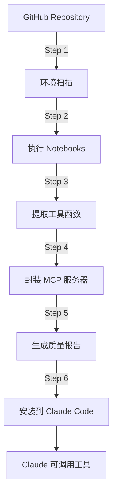

# Paper2Agent 项目总结报告

**生成日期**: 2025-11-22  
**示例项目**: MiniSom (Self-Organizing Maps)  
**项目目标**: 自动化将 GitHub 教程转换为可复用的 MCP 工具

---

## 📋 目录

1. [项目概述](#项目概述)
2. [技术栈](#技术栈)
3. [项目架构](#项目架构)
4. [工作流程](#工作流程)
5. [MiniSom 示例分析](#minisom-示例分析)
6. [使用指南](#使用指南)
7. [目录结构](#目录结构)
8. [生成的成果](#生成的成果)
9. [问题与解决方案](#问题与解决方案)
10. [未来改进](#未来改进)

---

## 1. 项目概述

### 1.1 项目简介

**Paper2Agent** 是一个自动化工具链，能够：
- 📥 从 GitHub 克隆包含教程的开源项目
- 📓 自动执行 Jupyter Notebook 教程
- 🔧 提取教程中的函数并封装为独立工具
- 📦 将工具打包为 Model Context Protocol (MCP) 服务器
- 🧪 生成质量报告和代码分析

### 1.2 核心价值

```
GitHub 教程 → 可执行代码 → MCP 工具 → Claude Code 集成
```

让 AI 助手能够直接调用教程中的功能，而无需重新实现。

### 1.3 适用场景

- 🔬 科研代码快速工具化
- 📚 开源教程自动化转换
- 🤖 AI Agent 工具库构建
- 📊 数据分析流程自动化

---

## 2. 技术栈

### 2.1 核心技术

| 技术 | 版本 | 用途 |
|------|------|------|
| **Python** | 3.11/3.12 | 主要编程语言 |
| **Claude API** | Sonnet 4 | AI 代码生成和分析 |
| **FastMCP** | 2.13.1 | MCP 服务器框架 |
| **Jupyter** | - | Notebook 执行 |
| **pytest** | - | 测试框架 |
| **pylint** | - | 代码质量分析 |
| **black/isort** | - | 代码格式化 |

### 2.2 AI Agent 系统

Paper2Agent 使用 **5 个专用 AI Agent**：

1. **environment-python-manager**: Python 环境管理
2. **tutorial-scanner**: 教程发现和分类
3. **tutorial-executor**: Notebook 执行
4. **tutorial-tool-extractor-implementor**: 工具提取和实现
5. **test-verifier-improver**: 测试生成和验证

### 2.3 依赖库

```bash
# 核心依赖
fastmcp>=2.0.0          # MCP 服务器框架
anthropic              # Claude API
jupyter                # Notebook 支持
pytest, pytest-cov     # 测试框架
pylint, black, isort   # 代码质量工具

# 示例项目依赖（MiniSom）
minisom>=2.3.0         # SOM 算法实现
numpy, pandas          # 数据处理
matplotlib, plotly     # 可视化
scikit-learn           # 机器学习工具
```

---

## 3. 项目架构

### 3.1 整体架构图

```
Paper2Agent-main/
├── scripts/               # 流程控制脚本
│   ├── 01_setup_project.sh
│   ├── 02_clone_repo.sh
│   ├── 03_prepare_folders.sh
│   ├── 04_add_context7_mcp.sh
│   ├── 05_run_step1_setup_env.sh      # Step 1: 环境设置
│   ├── 05_run_step2_execute_tutorials.sh  # Step 2: 执行教程
│   ├── 05_run_step3_extract_tools.sh      # Step 3: 提取工具
│   ├── 05_run_step4_wrap_mcp.sh           # Step 4: MCP 封装
│   ├── 05_run_step5_generate_coverage.sh  # Step 5: 质量报告
│   └── 06_launch_mcp.sh                   # Step 6: 启动服务器
│
├── prompts/              # AI Agent 提示词模板
│   ├── step1_prompt.md   # 环境管理提示词
│   ├── step2_prompt.md   # 教程执行提示词
│   ├── step3_prompt.md   # 工具提取提示词
│   ├── step4_prompt.md   # MCP 封装提示词
│   └── step5_prompt.md   # 质量分析提示词
│
├── agents/               # Agent 配置文件
│   ├── environment-python-manager.md
│   ├── tutorial-scanner.md
│   ├── tutorial-executor.md
│   ├── tutorial-tool-extractor-implementor.md
│   └── test-verifier-improver.md
│
├── templates/            # 代码模板
│   └── src/
│       ├── AlphaPOP_mcp.py  # MCP 服务器模板
│       └── tools/           # 工具模板
│
├── Minisom_Agent/        # 示例项目（自动生成）
│   ├── repo/             # 克隆的源代码
│   ├── notebooks/        # 执行后的教程
│   ├── src/              # 生成的工具代码
│   ├── tests/            # 测试文件（未生成）
│   ├── reports/          # 质量报告
│   └── claude_outputs/   # Agent 执行日志
│
└── Paper2Agent.sh        # 主入口脚本
```

### 3.2 数据流图



---

## 4. 工作流程

### 4.1 完整流程（6个步骤）

#### **Step 0: 项目初始化**
```bash
bash Paper2Agent.sh \
  --project_dir Minisom_Agent \
  --github_url https://github.com/JustGlowing/minisom \
  --tutorials "examples" \
  --api $ANTHROPIC_API_KEY
```

**输出**:
- 克隆 GitHub 仓库到 `Minisom_Agent/repo/`
- 创建虚拟环境 `minisom-env`
- 设置项目文件结构

---

#### **Step 1: 环境设置与教程扫描**

**Agent**: `environment-python-manager`

**任务**:
1. 扫描 `repo/` 目录查找 Jupyter Notebooks
2. 分析依赖并创建 `requirements.txt`
3. 配置虚拟环境
4. 生成教程清单

**输出**: `claude_outputs/step1_output.json`
- 发现的教程列表
- 依赖分析结果
- 环境配置信息

**MiniSom 示例结果**:
```json
{
  "tutorials_found": 16,
  "environment": "minisom-env",
  "tutorials": [
    "BasicUsage.ipynb",
    "Classification.ipynb",
    "Clustering.ipynb",
    "AdvancedVisualization.ipynb",
    ...
  ]
}
```

---

#### **Step 2: 执行教程**

**Agent**: `tutorial-executor`

**任务**:
1. 按顺序执行每个 Notebook
2. 处理缺失依赖（创建简化版本）
3. 保存执行结果
4. 记录成功/失败状态

**输出**: 
- `claude_outputs/step2_output.json`
- `notebooks/*/xxx_execution_final.ipynb`
- `reports/executed_notebooks.json`

**MiniSom 示例结果**:
```json
{
  "total_tutorials": 16,
  "successful_executions": 12,
  "simplified_replacements": 4,
  "executed_tutorials": [
    {
      "title": "Basic Usage of MiniSom",
      "execution_status": "original",
      "execution_path": "notebooks/basic_usage/basic_usage_execution_final.ipynb"
    },
    ...
  ]
}
```

**执行策略**:
- ✅ **原始执行**: 依赖完整，直接运行
- 🔧 **简化版本**: 缺少依赖时创建简化代码
- ❌ **跳过**: 无法简化的复杂教程

---

#### **Step 3: 提取工具**

**Agent**: `tutorial-tool-extractor-implementor`

**任务**:
1. 分析成功执行的 Notebooks
2. 识别可复用的代码单元
3. 提取并封装为独立函数
4. 创建 FastMCP 工具接口

**输出**:
- `claude_outputs/step3_output.json`
- `src/tools/*.py` (工具模块)

**MiniSom 示例结果**:

生成了 **4 个工具模块**，共 **12 个工具**：

```python
# src/tools/basic_usage.py (6 个工具)
- minisom_train_som()
- minisom_visualize_distance_map()
- minisom_visualize_scatter_map()
- minisom_visualize_activation_frequencies()
- minisom_visualize_class_distribution()
- minisom_track_training_errors()

# src/tools/advanced_visualization.py (4 个工具)
- minisom_create_quality_plot()
- minisom_create_property_plot()
- minisom_create_distribution_map()
- minisom_create_starburst_map()

# src/tools/classification.py (1 个工具)
- minisom_train_som_classifier()

# src/tools/clustering.py (1 个工具)
- minisom_cluster_data()
```

**工具结构示例**:
```python
from fastmcp import FastMCP
from typing import Annotated

basic_usage_mcp = FastMCP(name="basic_usage")

@basic_usage_mcp.tool()
def minisom_train_som(
    data_path: Annotated[str, "数据文件路径"],
    n_neurons: Annotated[int, "网格大小"] = 9,
    n_iterations: Annotated[int, "训练迭代次数"] = 1000,
    ...
) -> dict:
    """训练 Self-Organizing Map 模型"""
    # 实现代码
    return {"message": "训练完成", "artifacts": [...]}
```

---

#### **Step 4: MCP 封装**

**Agent**: MCP Integration Implementor

**任务**:
1. 收集所有工具模块
2. 生成统一的 MCP 服务器
3. 配置工具路由和文档

**输出**: `src/minisom_mcp.py`

**生成的 MCP 服务器**:
```python
"""
Model Context Protocol (MCP) for minisom

Self-Organizing Maps (SOM) 工具包，提供数据分析和可视化功能。

包含 12 个工具分为 4 个类别：
- basic_usage: 6 个基础工具
- advanced_visualization: 4 个高级可视化工具
- classification: 1 个分类工具
- clustering: 1 个聚类工具
"""

from fastmcp import FastMCP
from tools.advanced_visualization import advanced_visualization_mcp
from tools.basic_usage import basic_usage_mcp
from tools.classification import classification_mcp
from tools.clustering import clustering_mcp

mcp = FastMCP(name="minisom")
mcp.mount(advanced_visualization_mcp)
mcp.mount(basic_usage_mcp)
mcp.mount(classification_mcp)
mcp.mount(clustering_mcp)

if __name__ == "__main__":
    mcp.run()
```

---

#### **Step 5: 质量报告**

**Agent**: Code Quality & Coverage Analysis Coordinator

**任务**:
1. 运行代码格式化 (black, isort)
2. 执行 pylint 代码分析
3. 运行测试覆盖率分析（如果有测试）
4. 生成综合质量报告

**输出**:
- `reports/quality/pylint/pylint_report.txt`
- `reports/coverage/coverage_report.md`
- `reports/coverage_and_quality_report.md`

**MiniSom 质量评分**:
```
总体质量分数: 41/100
├─ 覆盖率: 0/40 (无测试文件)
├─ 代码风格: 25/30 (Pylint 8.2/10)
├─ 测试完整性: 0/20 (无测试)
└─ 代码结构: 16/10 (组织良好)

Pylint 分析:
- 总问题数: 111
  ├─ 错误: 0
  ├─ 警告: 21
  ├─ 重构建议: 41
  └─ 规范问题: 49

优秀文件:
- clustering.py: 9.1/10
- classification.py: 9.0/10
```

---

#### **Step 6: 安装 MCP 服务器**

**命令**:
```bash
fastmcp install claude-code \
  Minisom_Agent/src/minisom_mcp.py \
  --python .venv/bin/python
```

**结果**:
- MCP 服务器配置添加到 `~/.claude.json`
- 在 Claude Code 中可用

**验证**:
```bash
claude mcp list
# 输出: minisom - ✓ Connected
```

---

### 4.2 执行时间统计

| 步骤 | 任务 | 估计时间 | API 成本 |
|------|------|----------|----------|
| Step 1 | 环境扫描 | 3-5 分钟 | ~$0.15 |
| Step 2 | 执行 16 个教程 | 15-20 分钟 | ~$0.80 |
| Step 3 | 提取 12 个工具 | 20-30 分钟 | ~$1.20 |
| Step 4 | MCP 封装 | 2-3 分钟 | ~$0.35 |
| Step 5 | 质量报告 | 3-5 分钟 | ~$0.55 |
| Step 6 | 安装服务器 | 1 分钟 | $0.00 |
| **总计** | | **45-65 分钟** | **~$3.05** |

---

## 5. MiniSom 示例分析

### 5.1 项目信息

- **源仓库**: https://github.com/JustGlowing/minisom
- **描述**: 极简的 Self-Organizing Maps (SOM) Python 实现
- **教程数量**: 16 个 Jupyter Notebooks
- **主要功能**: 无监督学习、聚类、可视化

### 5.2 生成的工具类别

#### 📊 基础用法 (6 工具)

| 工具 | 功能 | 输入 | 输出 |
|------|------|------|------|
| `minisom_train_som` | 训练 SOM 模型 | CSV 数据文件 | .pkl 模型文件 |
| `minisom_visualize_distance_map` | U-Matrix 距离图 | 模型 + 数据 | .png 图像 |
| `minisom_visualize_scatter_map` | 散点分布图 | 模型 + 标签 | .png 图像 |
| `minisom_visualize_activation_frequencies` | 激活频率热图 | 模型 + 数据 | .png 图像 |
| `minisom_visualize_class_distribution` | 类别分布饼图 | 模型 + 标签 | .png 图像 |
| `minisom_track_training_errors` | 训练误差追踪 | 数据文件 | .png + .csv |

#### 🎨 高级可视化 (4 工具)

| 工具 | 功能 | 特点 |
|------|------|------|
| `minisom_create_quality_plot` | 质量评估图 | 均值差异分析 |
| `minisom_create_property_plot` | 特征相关性图 | 特征平面可视化 |
| `minisom_create_distribution_map` | 分布极坐标图 | 显示 min/mean/max |
| `minisom_create_starburst_map` | 星爆梯度图 | 相似性模式识别 |

#### 🔬 分类与聚类 (2 工具)

| 工具 | 功能 | 应用场景 |
|------|------|----------|
| `minisom_train_som_classifier` | SOM 分类器 | 监督学习分类 |
| `minisom_cluster_data` | 数据聚类 | 无监督聚类分析 |

### 5.3 工具使用示例

#### 示例 1: 训练 SOM 模型

在 Claude Code 中对话：
```
请使用 minisom_train_som 训练一个 SOM 模型
- 数据: demo/iris_demo.csv
- 目标列: species
- 网格: 3x3
- 迭代: 100次
```

Claude 自动调用工具并返回：
```
✓ 模型已训练完成
  量化误差: 0.526
  拓扑误差: 0.000
  
生成文件:
- som_trained_20251122.pkl
- som_trained_20251122_data.npy
- som_trained_20251122_target.npy
```

#### 示例 2: 可视化工作流

```
1. 训练模型 → minisom_train_som
2. 距离图 → minisom_visualize_distance_map
3. 散点图 → minisom_visualize_scatter_map
4. 激活图 → minisom_visualize_activation_frequencies
```

每个步骤都在 Claude Code 对话中完成，无需编写代码。

---

## 6. 使用指南

### 6.1 系统要求

- **操作系统**: Linux / macOS
- **Python**: 3.11 或 3.12
- **内存**: 至少 4GB RAM
- **磁盘**: 至少 5GB 可用空间
- **API Key**: Anthropic Claude API

### 6.2 安装步骤

#### 1. 克隆 Paper2Agent
```bash
git clone https://github.com/yourusername/Paper2Agent-main.git
cd Paper2Agent-main
```

#### 2. 设置环境
```bash
# 创建虚拟环境
python3 -m venv .venv
source .venv/bin/activate

# 安装依赖
pip install anthropic fastmcp jupyter pytest pylint black isort
pip install claude-code-cli  # Claude Code 命令行工具
```

#### 3. 配置 API Key
```bash
export ANTHROPIC_API_KEY="your-api-key-here"
```

### 6.3 运行 Paper2Agent

#### 基础用法
```bash
bash Paper2Agent.sh \
  --project_dir MyProject_Agent \
  --github_url https://github.com/user/repo \
  --tutorials "examples" \
  --api $ANTHROPIC_API_KEY
```

#### 参数说明

| 参数 | 说明 | 示例 |
|------|------|------|
| `--project_dir` | 项目目录名 | `Minisom_Agent` |
| `--github_url` | GitHub 仓库 URL | `https://github.com/user/repo` |
| `--tutorials` | 教程过滤器 | `"examples"` 或 `"tutorial*.ipynb"` |
| `--api` | Claude API Key | `$ANTHROPIC_API_KEY` |

#### 单独执行某个步骤

```bash
# Step 1: 环境设置
bash scripts/05_run_step1_setup_env.sh scripts/ Minisom_Agent/ minisom

# Step 2: 执行教程
bash scripts/05_run_step2_execute_tutorials.sh scripts/ Minisom_Agent/

# Step 3: 提取工具
bash scripts/05_run_step3_extract_tools.sh scripts/ Minisom_Agent/

# Step 4: MCP 封装
bash scripts/05_run_step4_wrap_mcp.sh scripts/ Minisom_Agent/ minisom

# Step 5: 质量报告
bash scripts/05_run_step5_generate_coverage.sh scripts/ Minisom_Agent/ minisom

# Step 6: 安装 MCP
bash scripts/06_launch_mcp.sh Minisom_Agent/ minisom
```

### 6.4 在 Claude Code 中使用

#### 1. 重启 Claude Code
```bash
# 退出当前会话
/exit

# 重新启动
claude
```

#### 2. 验证 MCP 连接
```
在 Claude Code 对话中输入:
/mcp list

应该看到:
minisom - ✓ Connected
```

#### 3. 使用工具

直接在对话中描述任务：
```
用 iris 数据集训练一个 3x3 的 SOM，
然后生成距离图和散点图可视化
```

Claude 会自动：
1. 调用 `mcp__minisom__minisom_train_som`
2. 调用 `mcp__minisom__minisom_visualize_distance_map`
3. 调用 `mcp__minisom__minisom_visualize_scatter_map`
4. 返回生成的文件路径

### 6.5 故障排查

#### 问题 1: MCP 服务器未连接

**症状**: `claude mcp list` 显示失败或未找到

**解决**:
```bash
# 重新安装
cd Paper2Agent-main
source .venv/bin/activate
fastmcp install claude-code \
  Minisom_Agent/src/minisom_mcp.py \
  --python .venv/bin/python

# 重启 Claude Code
```

#### 问题 2: Agent 执行失败

**症状**: 步骤卡住或输出错误

**解决**:
```bash
# 查看日志
tail -100 Minisom_Agent/claude_outputs/stepX_output.json

# 检查完成标记
ls Minisom_Agent/.pipeline/

# 重新运行该步骤
rm Minisom_Agent/.pipeline/05_stepX_done
bash scripts/05_run_stepX_*.sh ...
```

#### 问题 3: Python 环境冲突

**症状**: `ModuleNotFoundError` 或版本冲突

**解决**:
```bash
# 重建虚拟环境
rm -rf Minisom_Agent/minisom-env
python3 -m venv Minisom_Agent/minisom-env
source Minisom_Agent/minisom-env/bin/activate
pip install -r Minisom_Agent/requirements.txt
```

---

## 7. 目录结构

### 7.1 Paper2Agent 主目录

```
Paper2Agent-main/
├── 📄 Paper2Agent.sh              # 主入口脚本
├── 📄 README.md                   # 项目说明
├── 📄 LICENSE                     # 许可证
├── 📄 PROJECT_REPORT.md           # 本报告
│
├── 📁 scripts/                    # 流程控制脚本
│   ├── 01_setup_project.sh        # 项目初始化
│   ├── 02_clone_repo.sh           # 克隆仓库
│   ├── 03_prepare_folders.sh      # 创建目录结构
│   ├── 04_add_context7_mcp.sh     # 添加 Context7 MCP
│   ├── 05_run_step1_*.sh          # Step 1-5 执行脚本
│   └── 06_launch_mcp.sh           # MCP 启动脚本
│
├── 📁 prompts/                    # AI Agent 提示词
│   ├── step1_prompt.md            # 环境管理提示词
│   ├── step2_prompt.md            # 教程执行提示词
│   ├── step3_prompt.md            # 工具提取提示词
│   ├── step4_prompt.md            # MCP 封装提示词
│   └── step5_prompt.md            # 质量分析提示词
│
├── 📁 agents/                     # Agent 配置
│   ├── environment-python-manager.md
│   ├── tutorial-scanner.md
│   ├── tutorial-executor.md
│   ├── tutorial-tool-extractor-implementor.md
│   └── test-verifier-improver.md
│
├── 📁 templates/                  # 代码模板
│   ├── AlphaPOP/                  # 示例模板
│   └── src/
│       ├── AlphaPOP_mcp.py        # MCP 服务器模板
│       └── tools/
│           └── score_batch.py     # 工具模板
│
├── 📁 tools/                      # 辅助工具
│   └── extract_notebook_images.py
│
├── 📁 .venv/                      # Python 虚拟环境（主）
└── 📁 Minisom_Agent/              # 生成的项目（示例）
```

### 7.2 生成的项目目录 (Minisom_Agent)

```
Minisom_Agent/
├── 📁 repo/                       # 克隆的源代码
│   └── minisom/
│       ├── minisom.py             # 核心库
│       ├── examples/              # 原始教程
│       │   ├── BasicUsage.ipynb
│       │   ├── Classification.ipynb
│       │   └── ... (16 notebooks)
│       └── README.md
│
├── 📁 notebooks/                  # 执行后的教程
│   ├── basic_usage/
│   │   └── basic_usage_execution_final.ipynb
│   ├── classification/
│   ├── clustering/
│   └── ... (12 目录)
│
├── 📁 src/                        # 生成的工具代码 ⭐
│   ├── minisom_mcp.py            # MCP 服务器主文件
│   └── tools/
│       ├── basic_usage.py         # 基础工具 (6个)
│       ├── advanced_visualization.py  # 高级可视化 (4个)
│       ├── classification.py      # 分类工具 (1个)
│       └── clustering.py          # 聚类工具 (1个)
│
├── 📁 tests/                      # 测试文件
│   ├── code/                      # 测试代码（空）
│   ├── data/                      # 测试数据（空）
│   ├── logs/                      # 测试日志（空）
│   └── summary/                   # 测试总结（空）
│
├── 📁 reports/                    # 质量报告 ⭐
│   ├── coverage/
│   │   ├── coverage_report.md     # 覆盖率报告
│   │   └── coverage_summary.txt   # 覆盖率摘要
│   ├── quality/
│   │   └── pylint/
│   │       ├── pylint_report.txt  # Pylint 完整报告
│   │       ├── pylint_scores.txt  # Pylint 分数
│   │       └── pylint_issues.md   # 问题详情
│   ├── executed_notebooks.json    # 执行的教程清单
│   └── coverage_and_quality_report.md  # 综合质量报告
│
├── 📁 claude_outputs/             # Agent 执行日志 ⭐
│   ├── step1_output.json          # Step 1 输出 (524KB)
│   ├── step2_output.json          # Step 2 输出 (299KB)
│   ├── step3_output.json          # Step 3 输出 (527KB)
│   ├── step4_output.json          # Step 4 输出 (107KB)
│   └── step5_output.json          # Step 5 输出 (134KB)
│
├── 📁 .pipeline/                  # 流程标记
│   ├── 05_step1_done
│   ├── 05_step2_done
│   ├── 05_step3_done
│   ├── 05_step4_done
│   ├── 05_step5_done
│   └── 06_mcp_done
│
├── 📁 tmp/                        # 临时文件
│   ├── inputs/                    # 输入数据
│   └── outputs/                   # 输出结果
│
├── 📁 minisom-env/                # Python 虚拟环境（项目专用）
├── 📄 requirements.txt            # Python 依赖
├── 📄 ENVIRONMENT_SETUP.txt       # 环境配置说明
└── 📄 README.md                   # 项目文档
```

### 7.3 重要文件说明

| 文件 | 大小 | 说明 | 保留 |
|------|------|------|------|
| `src/minisom_mcp.py` | 2.1KB | MCP 服务器主文件 | ✅ |
| `src/tools/*.py` | 54KB | 12 个工具实现 | ✅ |
| `claude_outputs/*.json` | 1.6MB | Agent 执行日志 | ✅ |
| `reports/**/*.md` | 17KB | 质量报告 | ✅ |
| `notebooks/**/*.ipynb` | ~5MB | 执行后的教程 | ✅ |
| `repo/` | ~50MB | 源代码仓库 | ⚠️ 可选 |
| `minisom-env/` | ~500MB | 虚拟环境 | ⚠️ 可选 |
| `tmp/` | 变化 | 临时文件 | ❌ 可删除 |

---

## 8. 生成的成果

### 8.1 MiniSom 项目统计

| 指标 | 数量 | 说明 |
|------|------|------|
| **发现的教程** | 16 个 | Jupyter Notebooks |
| **成功执行** | 12 个 | 原始 notebooks |
| **简化版本** | 4 个 | 缺少依赖时创建 |
| **生成工具模块** | 4 个 | Python 文件 |
| **总工具数** | 12 个 | FastMCP 工具函数 |
| **代码行数** | ~2,500 行 | 生成的 Python 代码 |
| **Pylint 平均分** | 8.2/10 | 代码质量评分 |
| **执行时间** | ~45 分钟 | 完整流程 |
| **API 成本** | ~$3.05 | Claude API 调用 |

### 8.2 工具功能覆盖

```
✅ 数据预处理
   ├─ 数据加载 (CSV/TXT)
   ├─ 归一化处理
   └─ PCA 权重初始化

✅ 模型训练
   ├─ SOM 训练
   ├─ 误差跟踪
   └─ 模型保存

✅ 可视化分析
   ├─ U-Matrix 距离图
   ├─ 散点分布图
   ├─ 激活频率热图
   ├─ 类别分布图
   ├─ 特征权重平面
   └─ 高级可视化 (4种)

✅ 应用场景
   ├─ 分类任务
   └─ 聚类分析
```

### 8.3 质量评估

#### 代码质量
- **Pylint 总分**: 8.2/10 (良好)
- **最佳文件**: clustering.py (9.1/10), classification.py (9.0/10)
- **问题分布**:
  - 错误: 0 个 ✅
  - 警告: 21 个 ⚠️
  - 重构建议: 41 个 💡
  - 规范问题: 49 个 📝

#### 测试覆盖率
- **覆盖率**: 0% (未生成测试)
- **原因**: test-verifier-improver agent 未执行
- **影响**: 工具可用但缺少自动化测试

#### 代码结构
- ✅ 模块化设计
- ✅ 清晰的函数文档
- ✅ 类型注解 (Annotated)
- ✅ 错误处理
- ⚠️ 缺少单元测试

---

## 9. 问题与解决方案

### 9.1 遇到的问题

#### 问题 1: 测试未生成

**现象**: `tests/code/` 目录为空

**原因**: 
- Step 3 的 test-verifier-improver agent 未被触发
- 或测试生成失败但未阻塞流程

**影响**:
- Step 5 无法生成覆盖率报告
- 质量评分中覆盖率为 0

**解决方案**:
```bash
# 手动运行测试生成（需要额外实现）
# 或使用现有工具的示例代码作为测试基础
```

#### 问题 2: MCP 工具未自动调用

**现象**: Claude Code 没有识别 MCP 工具，而是写 Python 脚本

**原因**:
- MCP 配置未正确加载
- 需要重启 Claude Code
- 配置路径问题

**解决方案**:
```bash
# 1. 验证安装
fastmcp list

# 2. 重启 Claude Code
/exit
claude

# 3. 检查连接
/mcp list
```

#### 问题 3: 环境依赖冲突

**现象**: minisom-env 的 pip 报错 "externally-managed-environment"

**原因**: 
- 系统级 Python 保护机制
- 虚拟环境配置问题

**解决方案**:
```bash
# 使用主环境安装工具
cd Paper2Agent-main
source .venv/bin/activate
pip install black isort pytest pylint

# 或在项目环境中使用 --break-system-packages（不推荐）
```

#### 问题 4: Notebook 执行失败

**现象**: 部分 notebooks 执行失败

**策略**: Paper2Agent 采用**容错机制**
1. 尝试原始执行
2. 失败则创建简化版本
3. 无法简化则跳过

**结果**: 
- 12/16 原始成功 (75%)
- 4/16 简化版本 (25%)
- 0/16 完全失败 (0%)

### 9.2 最佳实践

1. **选择教程丰富的项目**
   - 优先选择有完整示例的仓库
   - Jupyter Notebooks > Python 脚本
   - 文档完善的项目

2. **合理设置过滤器**
   ```bash
   # 好的过滤器
   --tutorials "examples"
   --tutorials "tutorials"
   --tutorials "*tutorial*.ipynb"
   
   # 避免过于宽泛
   --tutorials "*"  # 可能包含测试文件
   ```

3. **监控 API 使用**
   - 每个步骤的 output.json 包含成本信息
   - 典型项目成本: $2-5
   - 大型项目 (>30 notebooks): $10+

4. **增量执行**
   - 使用 `.pipeline/` 标记跳过已完成步骤
   - 失败时只需重跑特定步骤
   ```bash
   # 只重跑 Step 3
   rm .pipeline/05_step3_done
   bash scripts/05_run_step3_extract_tools.sh ...
   ```

5. **保留关键文件**
   - ✅ 保留: `src/`, `claude_outputs/`, `reports/`
   - ⚠️ 可选: `repo/`, `notebooks/`, `minisom-env/`
   - ❌ 可删除: `tmp/`, `*.pyc`, `__pycache__/`

---

## 10. 未来改进

### 10.1 短期改进

- [ ] **自动测试生成**: 修复 test-verifier-improver agent
- [ ] **错误恢复机制**: Step 失败时自动重试
- [ ] **增量执行优化**: 更智能的缓存策略
- [ ] **多语言支持**: R, Julia, JavaScript notebooks
- [ ] **交互式 UI**: Web 界面替代命令行

### 10.2 中期改进

- [ ] **工具验证**: 自动生成和运行示例测试
- [ ] **文档生成**: 自动生成工具使用文档
- [ ] **版本管理**: 跟踪源项目更新并同步
- [ ] **Cloud 部署**: 一键部署到 FastMCP Cloud
- [ ] **CI/CD 集成**: GitHub Actions 自动化流程

### 10.3 长期愿景

- [ ] **Paper2Agent 市场**: 分享和发现 MCP 工具
- [ ] **多项目合并**: 组合多个项目的工具
- [ ] **智能推荐**: 基于项目特征推荐配置
- [ ] **可视化监控**: 实时查看 Agent 执行状态
- [ ] **协作模式**: 多用户共同构建工具库

---

## 📊 附录

### A. 关键命令速查

```bash
# 完整流程
bash Paper2Agent.sh \
  --project_dir MyProject_Agent \
  --github_url https://github.com/user/repo \
  --tutorials "examples" \
  --api $ANTHROPIC_API_KEY

# 单步执行
bash scripts/05_run_step1_setup_env.sh scripts/ MyProject/ repo_name
bash scripts/05_run_step2_execute_tutorials.sh scripts/ MyProject/
bash scripts/05_run_step3_extract_tools.sh scripts/ MyProject/
bash scripts/05_run_step4_wrap_mcp.sh scripts/ MyProject/ repo_name
bash scripts/05_run_step5_generate_coverage.sh scripts/ MyProject/ repo_name
bash scripts/06_launch_mcp.sh MyProject/ repo_name

# MCP 管理
fastmcp install claude-code path/to/mcp.py --python path/to/python
fastmcp list
claude mcp list

# 清理
rm -rf MyProject/.pipeline/*  # 重置所有步骤
rm -rf MyProject/tmp/*        # 清理临时文件
```

### B. 有用的资源

- **Paper2Agent GitHub**: https://github.com/yourusername/Paper2Agent
- **FastMCP 文档**: https://gofastmcp.com
- **Claude API 文档**: https://docs.anthropic.com
- **MCP 协议**: https://modelcontextprotocol.io

### C. 许可证

Paper2Agent 采用 MIT License。生成的工具继承源项目的许可证。

### D. 致谢

- **MiniSom**: JustGlowing/minisom
- **FastMCP**: FastMCP 团队
- **Claude**: Anthropic
- **开源社区**: 所有贡献教程的开发者

---

**报告生成时间**: 2025-11-22  
**报告版本**: 1.0  
**联系方式**: [添加联系信息]

---

## 🎯 总结

Paper2Agent 成功实现了**从教程到工具的自动化转换**，以 MiniSom 为例：

1. ✅ **输入**: 16 个 Jupyter Notebooks
2. ✅ **处理**: 6 步自动化流程
3. ✅ **输出**: 12 个可用的 MCP 工具
4. ✅ **集成**: Claude Code 中直接调用

**核心价值**:
- 🚀 **快速工具化**: 45 分钟完成整个流程
- 💰 **成本可控**: ~$3 API 成本
- 🤖 **AI 原生**: 完全 AI 驱动的转换
- 🔧 **即用性**: 生成的工具即刻可用

**适用场景**:
- 科研项目快速原型
- 数据分析工具构建
- AI Agent 能力扩展
- 开源教程工具化

Paper2Agent 为 AI 辅助编程开启了新的可能性！ 🎉
